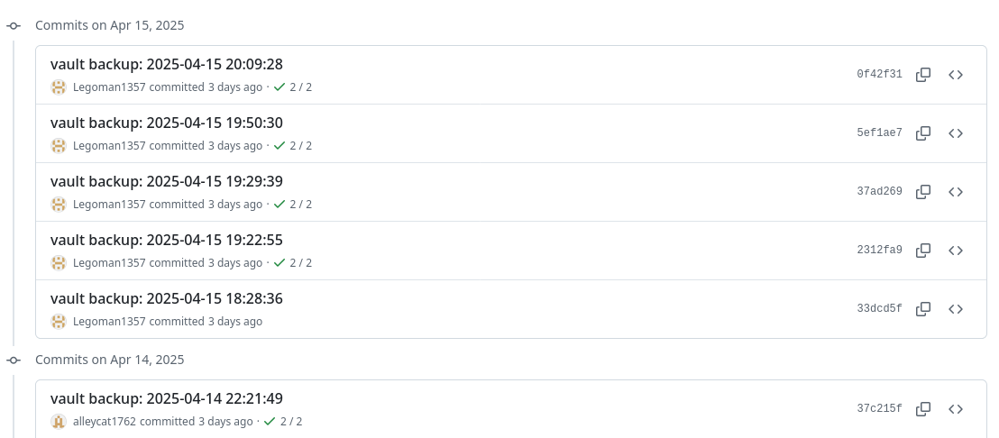

# House Lovell Wiki

Deployed URL: https://house-lovell.github.io/court-of-blades-wiki

## Basic setup

Full tutorial with screenshots & videos: https://dev.to/defenderofbasic/host-your-obsidian-notebook-on-github-pages-for-free-8l1. 

##### Steps for Windows Users

Requirements:

1. Download Github Desktop
2. Download Obsidian.md 

Setup
1. Clone this repository for local use
2. Open Obsidian and select "Open Folder As Vault"
3. Select the folder that Github Desktop downloaded called `court-of-blades-wiki`
4. In Obsidian, enable community plugins
5. In Obsidian, install the `git` community plugin by Vinzent
6. Restart Obsidian for the git plugin to load
7. Configure the git plugin with the correct path to the git executable that comes with Github Desktop

Syncing
1. Before you start editing anything, run a `git pull` command to get the latest changes from others.
2. To sync changes, use the `Git: Commit-and-sync` command from the Obsidian command palette. (`Ctrl + P` opens the command palette)
3. You can verify your changes by viewing the most recent commits [here on Github](https://github.com/house-lovell/court-of-blades-wiki/commits/main/)

4. Changes are pushed to the website when the automated GitHub actions complete, indicated by the green arrow.

